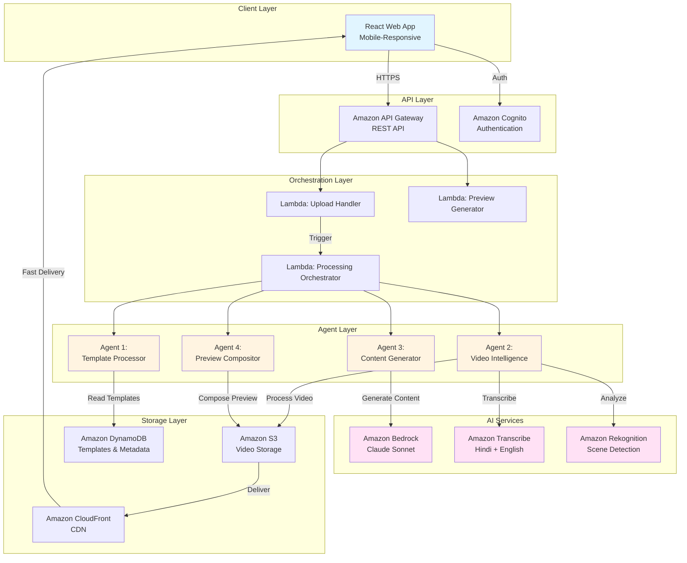
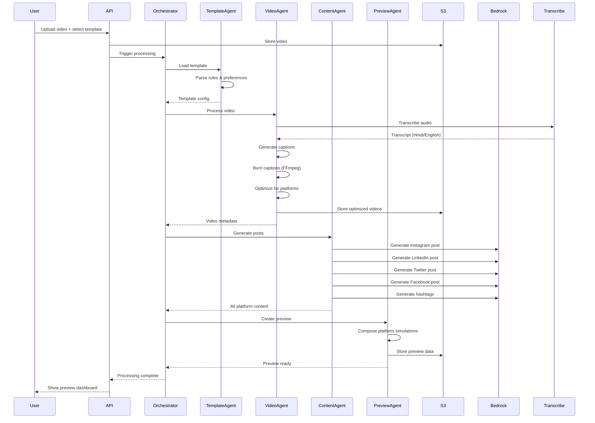

# Design Document: OneSource Platform

## Overview

OneSource is an AI-powered multi-platform content creation tool that transforms a single video into platform-optimized content for Instagram, LinkedIn, Twitter/X, and Facebook. The system employs a four-agent architecture orchestrated through AWS Lambda, leveraging Amazon Bedrock (Claude Sonnet) for intelligent content generation, Amazon Transcribe for bilingual speech-to-text, Amazon Rekognition for video analysis, and FFmpeg for video processing.

### Design Philosophy

The platform is designed with three core principles:

1. **Mobile-First**: Optimized for India's mobile-dominant user base with responsive design, touch-friendly interfaces, and 3G/4G network optimization
2. **Template-Driven**: One-time configuration through visual template builder, then automated content generation for every subsequent upload
3. **AI-Powered Intelligence**: Leveraging AWS AI services for transcription, content adaptation, hashtag generation, and cultural localization

### Key Design Decisions

- **Serverless Architecture**: AWS Lambda for automatic scaling and cost efficiency
- **Agent-Based Processing**: Four specialized agents (Template Processor, Video Intelligence, Content Generator, Preview Compositor) for separation of concerns
- **Asynchronous Processing**: Event-driven architecture using S3 triggers and Lambda orchestration
- **CDN-First Delivery**: CloudFront for low-latency video delivery to Indian users
- **NoSQL Storage**: DynamoDB for flexible template schema and fast queries

## Architecture

### System Architecture Diagram



### Processing Flow



### Agent Responsibilities

**Agent 1: Template Processor**
- Retrieves user template from DynamoDB
- Parses brand voice, language preferences, platform settings
- Loads brand assets (logos, colors) from S3
- Validates template data integrity
- Formats preferences into structured JSON for other agents

**Agent 2: Video Intelligence**
- Transcribes audio using Amazon Transcribe (Hindi/English/mixed)
- Detects scenes using Amazon Rekognition
- Generates synchronized captions with timing
- Burns captions onto video using FFmpeg
- Applies brand assets (logos, colors, end cards)
- Creates platform-specific video formats (resolutions, aspect ratios)
- Stores optimized videos in S3

**Agent 3: Content Generator**
- Receives transcript and template preferences
- Uses Amazon Bedrock (Claude Sonnet) for content generation
- Generates platform-specific text posts (Instagram, LinkedIn, Twitter/X, Facebook)
- Adapts tone while maintaining brand voice
- Creates contextually relevant hashtags
- Handles bilingual output (English/Hindi/Hinglish)
- Respects platform character limits

**Agent 4: Preview Compositor**
- Retrieves optimized videos and generated content
- Creates mobile-responsive preview dashboard
- Renders platform-accurate simulations
- Generates downloadable packages (ZIP files, organized folders)
- Handles real-time preview updates during editing

## Components and Interfaces

### Frontend Components

#### VideoUploadComponent
```typescript
interface VideoUploadProps {
  onUploadComplete: (videoId: string) => void;
  maxFileSize: number; // 500MB
  acceptedFormats: string[]; // ['mp4', 'mov', 'avi', 'webm']
  minDuration: number; // 15 seconds
  maxDuration: number; // 10 minutes
}

interface UploadState {
  progress: number; // 0-100
  status: 'idle' | 'uploading' | 'processing' | 'complete' | 'error';
  errorMessage?: string;
}
```

**Responsibilities:**
- File validation (format, size, duration)
- Progress tracking with real-time updates
- Mobile-optimized file picker integration
- Retry mechanism for failed uploads
- S3 multipart upload for large files

#### TemplateBuilderComponent
```typescript
interface Template {
  id: string;
  name: string;
  userId: string;
  brandVoice: string;
  languagePreference: 'english' | 'hindi' | 'hinglish';
  brandAssets: BrandAssets;
  platformPreferences: PlatformPreferences;
  hashtagCollections: string[][];
  isDefault: boolean;
  createdAt: Date;
  updatedAt: Date;
}

interface BrandAssets {
  logoUrl?: string;
  logoPlacement: 'end-card' | 'watermark' | 'none';
  primaryColor: string; // HEX
  secondaryColor: string; // HEX
  accentColor: string; // HEX
  tagline?: string; // max 100 chars
}

interface PlatformPreferences {
  instagram: InstagramPreferences;
  linkedin: LinkedInPreferences;
  twitter: TwitterPreferences;
  facebook: FacebookPreferences;
}

interface InstagramPreferences {
  emojiUsage: 'none' | 'light' | 'moderate' | 'heavy';
  hashtagCount: number; // 5-30
  ctaText?: string;
  captionLength: 'short' | 'medium' | 'long';
  firstCommentHashtags: boolean;
  hookStyle: 'question' | 'statement' | 'statistic' | 'story';
}

interface LinkedInPreferences {
  format: 'short' | 'long' | 'article';
  tone: 'professional' | 'casual' | 'thought-leader';
  professionalInsights: boolean;
  carouselSuggestions: boolean;
  documentFormatting: boolean;
}

interface TwitterPreferences {
  format: 'single' | 'thread';
  engagementQuestions: boolean;
  abbreviations: boolean;
  pollSuggestions: boolean;
  characterLimit: 280;
}

interface FacebookPreferences {
  communityTone: 'friendly' | 'professional' | 'casual';
  length: 'short' | 'medium' | 'long';
  conversationStarters: boolean;
  groupFriendly: boolean;
}
```

**Responsibilities:**
- Visual template builder with dropdowns, toggles, sliders
- Pre-built template selection
- Brand asset upload and management
- Platform-specific preference configuration
- Template save/load/edit operations
- Default template management

#### PreviewDashboardComponent
```typescript
interface PreviewDashboardProps {
  videoId: string;
  platformContent: PlatformContent[];
  onEdit: (platform: Platform, newContent: string) => void;
  onDownload: (platforms: Platform[]) => void;
}

interface PlatformContent {
  platform: 'instagram' | 'linkedin' | 'twitter' | 'facebook';
  videoUrl: string;
  textPost: string;
  hashtags: string[];
  cta?: string;
  characterCount: number;
}

interface PreviewState {
  selectedPlatform: Platform;
  theme: 'light' | 'dark';
  editMode: boolean;
}
```

**Responsibilities:**
- Mobile-responsive layout with platform cards
- Platform-accurate simulations (feed layouts)
- Video player with caption preview
- Real-time text editing with character count
- Dark/light mode toggle
- Download orchestration (individual/all platforms)
- Copy to clipboard functionality

#### CaptionEditorComponent
```typescript
interface CaptionEditorProps {
  videoUrl: string;
  captions: Caption[];
  onCaptionUpdate: (captions: Caption[]) => void;
  onStyleUpdate: (style: CaptionStyle) => void;
}

interface Caption {
  id: string;
  text: string;
  startTime: number; // milliseconds
  endTime: number; // milliseconds
  isHighlight: boolean;
}

interface CaptionStyle {
  position: 'bottom-centered' | 'top-centered' | 'floating' | 'word-by-word';
  fontFamily: string;
  fontSize: number; // 12-72px
  color: string; // HEX
  backgroundColor: string; // HEX with opacity
  textEffects: ('bold' | 'italic' | 'shadow')[];
}
```

**Responsibilities:**
- Timeline editor with waveform visualization
- Frame-level caption timing adjustment
- Caption style customization
- Real-time preview of caption changes
- Highlight key moments detection

### Backend Components

#### API Gateway Endpoints

```typescript
// Authentication
POST /auth/signup
POST /auth/login
POST /auth/logout
GET /auth/refresh

// Video Upload
POST /videos/upload
GET /videos/{videoId}/status
DELETE /videos/{videoId}

// Template Management
POST /templates
GET /templates
GET /templates/{templateId}
PUT /templates/{templateId}
DELETE /templates/{templateId}
PUT /templates/{templateId}/set-default

// Content Generation
POST /videos/{videoId}/process
GET /videos/{videoId}/content
PUT /videos/{videoId}/content/{platform}

// Download
GET /videos/{videoId}/download/{platform}
GET /videos/{videoId}/download/all

// User Management
GET /user/profile
PUT /user/profile
GET /user/usage
```

#### Lambda Functions

**UploadHandlerFunction**
```typescript
interface UploadHandlerInput {
  userId: string;
  fileName: string;
  fileSize: number;
  contentType: string;
}

interface UploadHandlerOutput {
  uploadUrl: string; // Pre-signed S3 URL
  videoId: string;
  expiresIn: number; // seconds
}
```

**ProcessingOrchestratorFunction**
```typescript
interface ProcessingInput {
  videoId: string;
  userId: string;
  templateId: string;
  videoS3Key: string;
}

interface ProcessingOutput {
  videoId: string;
  status: 'processing' | 'complete' | 'failed';
  platformContent: PlatformContent[];
  previewUrl: string;
  processingTime: number; // milliseconds
}
```

**PreviewGeneratorFunction**
```typescript
interface PreviewInput {
  videoId: string;
  platformContent: PlatformContent[];
  optimizedVideos: OptimizedVideo[];
}

interface PreviewOutput {
  previewUrl: string;
  dashboardData: DashboardData;
}
```

### Agent Interfaces

#### Agent 1: Template Processor

```typescript
interface TemplateProcessorInput {
  templateId: string;
  userId: string;
}

interface TemplateProcessorOutput {
  template: Template;
  brandAssets: BrandAssets;
  platformPreferences: PlatformPreferences;
  validationStatus: 'valid' | 'invalid';
  errors?: string[];
}

class TemplateProcessorAgent {
  async loadTemplate(templateId: string, userId: string): Promise<Template>;
  async parseRules(template: Template): Promise<ParsedRules>;
  async loadBrandAssets(template: Template): Promise<BrandAssets>;
  async validateTemplate(template: Template): Promise<ValidationResult>;
  async formatForAgents(template: Template): Promise<AgentConfig>;
}
```

#### Agent 2: Video Intelligence

```typescript
interface VideoIntelligenceInput {
  videoS3Key: string;
  template: Template;
  languagePreference: 'english' | 'hindi' | 'hinglish';
}

interface VideoIntelligenceOutput {
  transcript: Transcript;
  captions: Caption[];
  optimizedVideos: OptimizedVideo[];
  sceneData: SceneData[];
  processingMetadata: ProcessingMetadata;
}

interface Transcript {
  text: string;
  language: string;
  confidence: number;
  segments: TranscriptSegment[];
}

interface TranscriptSegment {
  text: string;
  startTime: number;
  endTime: number;
  confidence: number;
}

interface OptimizedVideo {
  platform: Platform;
  s3Key: string;
  url: string;
  resolution: string;
  aspectRatio: string;
  fileSize: number;
  duration: number;
}

interface SceneData {
  startTime: number;
  endTime: number;
  labels: string[];
  confidence: number;
}

class VideoIntelligenceAgent {
  async transcribeAudio(videoS3Key: string, language: string): Promise<Transcript>;
  async detectScenes(videoS3Key: string): Promise<SceneData[]>;
  async generateCaptions(transcript: Transcript): Promise<Caption[]>;
  async burnCaptions(videoS3Key: string, captions: Caption[], style: CaptionStyle): Promise<string>;
  async applyBranding(videoS3Key: string, brandAssets: BrandAssets): Promise<string>;
  async optimizeForPlatforms(videoS3Key: string): Promise<OptimizedVideo[]>;
}
```

#### Agent 3: Content Generator

```typescript
interface ContentGeneratorInput {
  transcript: Transcript;
  template: Template;
  sceneData: SceneData[];
  platformPreferences: PlatformPreferences;
}

interface ContentGeneratorOutput {
  platformContent: PlatformContent[];
  generationMetadata: GenerationMetadata;
}

interface GenerationMetadata {
  model: string; // 'claude-sonnet-3.5'
  tokensUsed: number;
  generationTime: number;
  language: string;
}

class ContentGeneratorAgent {
  async generateInstagramPost(input: ContentGeneratorInput): Promise<PlatformContent>;
  async generateLinkedInPost(input: ContentGeneratorInput): Promise<PlatformContent>;
  async generateTwitterPost(input: ContentGeneratorInput): Promise<PlatformContent>;
  async generateFacebookPost(input: ContentGeneratorInput): Promise<PlatformContent>;
  async generateHashtags(content: string, platform: Platform, count: number): Promise<string[]>;
  async adaptTone(content: string, tone: string, platform: Platform): Promise<string>;
  async translateToHindi(content: string): Promise<string>;
  async createHinglish(content: string): Promise<string>;
}
```

#### Agent 4: Preview Compositor

```typescript
interface PreviewCompositorInput {
  videoId: string;
  platformContent: PlatformContent[];
  optimizedVideos: OptimizedVideo[];
  template: Template;
}

interface PreviewCompositorOutput {
  dashboardData: DashboardData;
  previewUrl: string;
  downloadPackages: DownloadPackage[];
}

interface DashboardData {
  platforms: PlatformPreviewData[];
  theme: 'light' | 'dark';
  mobileOptimized: boolean;
}

interface PlatformPreviewData {
  platform: Platform;
  videoUrl: string;
  textPost: string;
  hashtags: string[];
  characterCount: number;
  simulationHtml: string; // Platform-accurate HTML
}

interface DownloadPackage {
  platform: Platform;
  zipUrl: string;
  files: DownloadFile[];
}

interface DownloadFile {
  name: string;
  type: 'video' | 'text';
  url: string;
  size: number;
}

class PreviewCompositorAgent {
  async composePlatformPreviews(input: PreviewCompositorInput): Promise<PlatformPreviewData[]>;
  async generatePlatformSimulation(platform: Platform, content: PlatformContent): Promise<string>;
  async createDownloadPackages(platformContent: PlatformContent[], videos: OptimizedVideo[]): Promise<DownloadPackage[]>;
  async generateDashboard(data: DashboardData): Promise<string>;
}
```

### External Service Interfaces

#### Amazon Bedrock (Claude Sonnet)

```typescript
interface BedrockRequest {
  modelId: 'anthropic.claude-3-sonnet-20240229-v1:0';
  contentType: 'application/json';
  accept: 'application/json';
  body: {
    anthropic_version: '2023-06-01';
    max_tokens: number;
    messages: Message[];
    temperature: number;
    system?: string;
  };
}

interface Message {
  role: 'user' | 'assistant';
  content: string;
}

interface BedrockResponse {
  id: string;
  type: 'message';
  role: 'assistant';
  content: ContentBlock[];
  model: string;
  stop_reason: string;
  usage: {
    input_tokens: number;
    output_tokens: number;
  };
}

interface ContentBlock {
  type: 'text';
  text: string;
}
```

#### Amazon Transcribe

```typescript
interface TranscribeJobRequest {
  TranscriptionJobName: string;
  LanguageCode: 'en-IN' | 'hi-IN';
  MediaFormat: 'mp4' | 'mov' | 'avi' | 'webm';
  Media: {
    MediaFileUri: string; // S3 URI
  };
  OutputBucketName: string;
  Settings: {
    ShowSpeakerLabels: boolean;
    MaxSpeakerLabels: number;
    ChannelIdentification: boolean;
  };
}

interface TranscribeJobResponse {
  TranscriptionJob: {
    TranscriptionJobName: string;
    TranscriptionJobStatus: 'IN_PROGRESS' | 'COMPLETED' | 'FAILED';
    LanguageCode: string;
    MediaFormat: string;
    Transcript: {
      TranscriptFileUri: string;
    };
  };
}

interface TranscriptOutput {
  jobName: string;
  accountId: string;
  results: {
    transcripts: Array<{ transcript: string }>;
    items: TranscriptItem[];
  };
}

interface TranscriptItem {
  start_time: string;
  end_time: string;
  alternatives: Array<{
    confidence: string;
    content: string;
  }>;
  type: 'pronunciation' | 'punctuation';
}
```

#### Amazon Rekognition

```typescript
interface RekognitionRequest {
  Video: {
    S3Object: {
      Bucket: string;
      Name: string;
    };
  };
  NotificationChannel: {
    SNSTopicArn: string;
    RoleArn: string;
  };
  ClientRequestToken: string;
}

interface RekognitionResponse {
  JobId: string;
}

interface LabelDetectionResult {
  JobStatus: 'IN_PROGRESS' | 'SUCCEEDED' | 'FAILED';
  Labels: DetectedLabel[];
}

interface DetectedLabel {
  Timestamp: number;
  Label: {
    Name: string;
    Confidence: number;
    Instances: Instance[];
    Parents: Parent[];
  };
}

interface Instance {
  BoundingBox: {
    Width: number;
    Height: number;
    Left: number;
    Top: number;
  };
  Confidence: number;
}
```

## Data Models

### DynamoDB Tables

#### Users Table
```typescript
interface UserRecord {
  PK: string; // USER#{userId}
  SK: string; // PROFILE
  userId: string;
  email: string;
  createdAt: string; // ISO 8601
  updatedAt: string;
  subscription: 'free' | 'pro' | 'enterprise';
  usage: {
    videosThisMonth: number;
    storageUsedMB: number;
    lastResetDate: string;
  };
  preferences: {
    defaultLanguage: 'english' | 'hindi' | 'hinglish';
    theme: 'light' | 'dark';
    notifications: boolean;
  };
}
```

**Access Patterns:**
- Get user by userId: PK = USER#{userId}, SK = PROFILE
- Update user preferences: PK = USER#{userId}, SK = PROFILE

#### Templates Table
```typescript
interface TemplateRecord {
  PK: string; // USER#{userId}
  SK: string; // TEMPLATE#{templateId}
  templateId: string;
  userId: string;
  name: string;
  brandVoice: string;
  languagePreference: 'english' | 'hindi' | 'hinglish';
  brandAssets: BrandAssets;
  platformPreferences: PlatformPreferences;
  hashtagCollections: string[][];
  isDefault: boolean;
  createdAt: string;
  updatedAt: string;
  GSI1PK: string; // TEMPLATE#{templateId}
  GSI1SK: string; // USER#{userId}
}
```

**Access Patterns:**
- Get all templates for user: PK = USER#{userId}, SK begins_with TEMPLATE#
- Get specific template: GSI1PK = TEMPLATE#{templateId}
- Get default template: PK = USER#{userId}, SK begins_with TEMPLATE#, filter isDefault = true

#### Videos Table
```typescript
interface VideoRecord {
  PK: string; // USER#{userId}
  SK: string; // VIDEO#{videoId}
  videoId: string;
  userId: string;
  originalFileName: string;
  s3Key: string;
  templateId: string;
  status: 'uploading' | 'processing' | 'complete' | 'failed';
  processingStage: 'upload' | 'transcription' | 'caption-generation' | 'content-generation' | 'preview';
  transcript: Transcript;
  captions: Caption[];
  platformContent: PlatformContent[];
  optimizedVideos: OptimizedVideo[];
  createdAt: string;
  updatedAt: string;
  expiresAt: number; // TTL for automatic cleanup (90 days)
  GSI1PK: string; // VIDEO#{videoId}
  GSI1SK: string; // STATUS#{status}
}
```

**Access Patterns:**
- Get all videos for user: PK = USER#{userId}, SK begins_with VIDEO#
- Get specific video: GSI1PK = VIDEO#{videoId}
- Get videos by status: GSI1SK = STATUS#{status}

#### Processing Jobs Table
```typescript
interface ProcessingJobRecord {
  PK: string; // JOB#{jobId}
  SK: string; // METADATA
  jobId: string;
  videoId: string;
  userId: string;
  jobType: 'transcription' | 'scene-detection' | 'content-generation';
  status: 'pending' | 'in-progress' | 'complete' | 'failed';
  startTime: string;
  endTime?: string;
  errorMessage?: string;
  metadata: Record<string, any>;
  expiresAt: number; // TTL (24 hours)
}
```

**Access Patterns:**
- Get job status: PK = JOB#{jobId}, SK = METADATA
- Track processing pipeline for video

### S3 Bucket Structure

```
onesource-videos/
├── uploads/
│   └── {userId}/
│       └── {videoId}/
│           └── original.{ext}
├── processed/
│   └── {userId}/
│       └── {videoId}/
│           ├── instagram/
│           │   └── video.mp4 (1080x1350)
│           ├── linkedin/
│           │   └── video.mp4 (1920x1080)
│           ├── twitter/
│           │   └── video.mp4 (1280x720)
│           └── facebook/
│               └── video.mp4 (1280x720)
├── brand-assets/
│   └── {userId}/
│       └── {templateId}/
│           └── logo.png
├── transcripts/
│   └── {userId}/
│       └── {videoId}/
│           └── transcript.json
└── temp/
    └── {jobId}/
        └── (temporary processing files)
```

### CloudFront Distribution

- **Origin**: S3 bucket (onesource-videos)
- **Edge Locations**: Prioritize India regions (Mumbai, Delhi, Chennai, Kolkata)
- **Cache Behavior**: 
  - Videos: Cache for 7 days
  - Brand assets: Cache for 30 days
  - Transcripts: Cache for 1 day
- **Compression**: Enable Gzip and Brotli
- **Security**: Signed URLs for private content

### API Response Models

#### Video Upload Response
```typescript
interface VideoUploadResponse {
  success: boolean;
  data: {
    videoId: string;
    uploadUrl: string;
    expiresIn: number;
  };
  error?: {
    code: string;
    message: string;
  };
}
```

#### Processing Status Response
```typescript
interface ProcessingStatusResponse {
  success: boolean;
  data: {
    videoId: string;
    status: 'uploading' | 'processing' | 'complete' | 'failed';
    stage: 'upload' | 'transcription' | 'caption-generation' | 'content-generation' | 'preview';
    progress: number; // 0-100
    estimatedTimeRemaining?: number; // seconds
    previewUrl?: string;
  };
  error?: {
    code: string;
    message: string;
  };
}
```

#### Content Response
```typescript
interface ContentResponse {
  success: boolean;
  data: {
    videoId: string;
    platformContent: PlatformContent[];
    optimizedVideos: OptimizedVideo[];
    transcript: Transcript;
    captions: Caption[];
  };
  error?: {
    code: string;
    message: string;
  };
}
```
